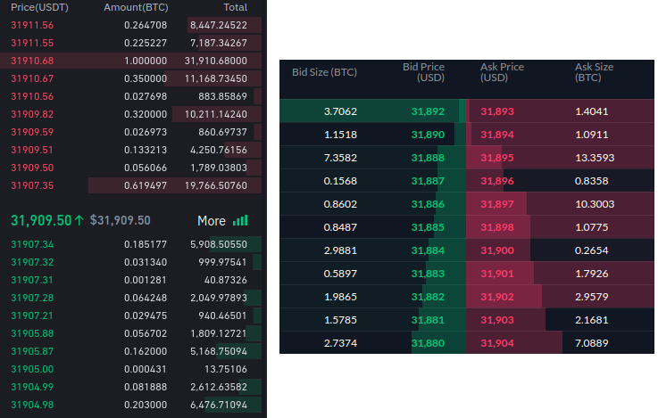
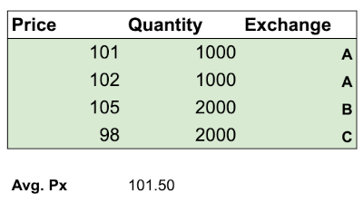
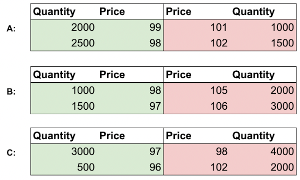
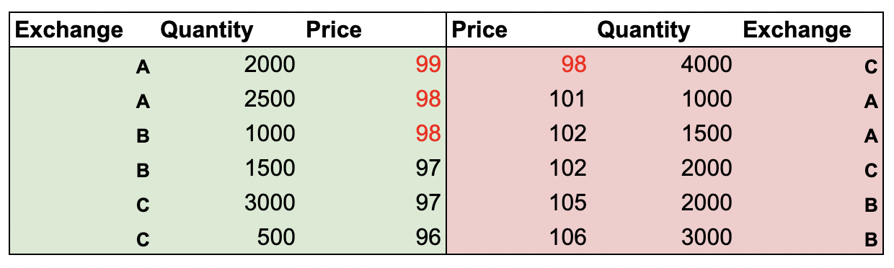

import { Tabs, TabItem } from '@astrojs/starlight/components';
import { Steps } from '@astrojs/starlight/components';


## Bid and Ask
On the exchange you have mainly two types of actors. 
The ones that wants to `buy`, and the other that wants to `sell`. 
The actors that wants to buy will place `BUY` limit orders on the market and it will affect the `Bid` side. 
The same goes for the actors that want to `SELL`, they will affect the `Ask` side. 


## Order Book
>    An order book is an electronic list of buy and sell orders for a specific security or financial instrument organized by price level. An order book lists the number of shares being bid or offered at each price point, or market depth. It also identifies the market participants behind the buy and sell orders, although some choose to remain anonymous.
>    
>    https://www.investopedia.com/terms/o/order-book.asp



Rules of thumbs for validation for order book:

* The Bid price is always lower than the Ask price once market is open. (if it does, it's usually network issues or something similar)
* The price can be the same before market opening or during market event such as halted stocks.
* No trades can legally occur outside the Bid and Ask price.

## Top of Book

The `highest bid price` and the `lowest ask price` is the `top of book` (`level 1`). 
The price difference between the Bid and Ask prices is called the spread (`Spread = Lowest Ask - Highest Bid`). 
The mid price is the result of the following formula : `Mid = Bid + (Spread  / 2)`.


## Market by Order, full depth or "Level 2"

The market data at it's most granular level (per order). 
All the events are recorded and it requires processing and memory power to derive the quotes from this.

<Steps>
1. The first market event recorded in the order book is an BUY. 
    ```
    | Order # | Actor | Event Type | Side | Quantity@Price |
    |---------|-------|------------|------|----------------|
    | #1      | A     | Add Order  | BUY  | 100@1.00       |
    ```
    
    The derived `top of book` or `level 1` in memory at this point in time.
    
    ```
    | Actor Bid | Bid Size | Bid Price | Ask Price | Ask Size | Actor Ask |
    | --------- | -------- | --------- | --------- | -------- | --------- |
    | A         | 100      | 1.00      |           |          |           |
    ```

2. Let's see what happens after a SELL so that we have both side. 
    ```
    | Order # | Actor | Event Type | Side | Quantity@Price |
    |---------|-------|------------|------|----------------|
    | #2      | B     | Add Order  | SELL | 100@1.05       |
    ```

    ```markdown {3}
    | Actor Bid | Bid Size | Bid Price | Ask Price | Ask Size | Actor Ask |
    | --------- | -------- | --------- | --------- | -------- | --------- |
    | A         | 100      | 1.00      | 1.05      | 100      | B         |
    ``` 
    * Bid is lower than ask    
    * The spread is 0.05.
    * The mid price would be 1.025

3.  Fast forward to more orders later ... 
    ```
    | Order # | Actor | Event Type | Side | Quantity@Price |
    |---------|-------|------------|------|----------------|
    | #3      | C     | Add Order  | BUY  | 100@0.99       |
    | #4      | D     | Add Order  | SELL | 1000@1.05      |
    ```
    
    ```markdown {3,4}
    | Actor Bid | Bid Size | Bid Price | Ask Price | Ask Size | Actor Ask |
    | --------- | -------- | --------- | --------- | -------- | --------- |
    | A         | 100      | 1.00      | 1.05      | 100      | B         |
    |           |          |           | 1.05      | 1000     | D         |
    | C         | 100      | 0.99      |           |          |          |
    ```

    * There are now two price levels for `Bids` (1.00 and 0.99) and one price level for `Asks` (1.05)
    * The bids are sorted by price DESC, timestamp ASC and asks are sorted price ASC, timestamp ASC
    * The market is FIFO so priority is given to the orders first placed.
    * The highlighed rows would be the `top of book`.

4.  Let's look at executions now. 
    ```
    | Order # | Actor | Event Type      | Side | Quantity@Price |
    |---------|-------|-----------------|------|----------------|
    | #5      | E/B   | Order Execution |      | 100@1.05       |
    | #6      | E/D   | Order Execution |      | 100@1.05       |
    ```

    ``` markdown {3}
    | Actor Bid | Bid Size | Bid Price | Ask Price | Ask Size | Actor Ask |
    | --------- | -------- | --------- | --------- | -------- | --------- |
    | A         | 100      | 1.00      | 1.05      | 900      | D         |
    | C         | 100      | 0.99      |           |          |           |
    ```

    * Order `B` from `top of book` is completely removed since the size is now at 0
    * Order `D` is still remaining in the `top of book` because there is still 900 left.

5.  And finally let's look at change orders. 
    * `D` decides to change the price to 1.06. 
    ```
    | Order # | Actor | Event Type      | Side | Quantity@Price |
    |---------|-------|-----------------|------|----------------|
    | #7      | D     | Change Order    |      | @1.06          |
    ```

    ```markdown {3} 
    | Actor Bid | Bid Size | Bid Price | Ask Price | Ask Size | Actor Ask |
    | --------- | -------- | --------- | --------- | -------- | --------- |
    | A         | 100      | 1.00      | 1.06      | 900      | D         |
    | C         | 100      | 0.99      |           |          |           |
    ```
    * Since the change `affects` the `top of book` 
    * The spread is now 0.06 and the mid price is 1.03

6. Add, cancel, change and execution are usually the events that affect the `order book`. 
However, only some operation affects the `top of book`. Some like `Trades` do not, and they are typically due to dark pools.

</Steps>

## Consolidated top of book

Source : https://www.machow.ski/posts/consolidated_order_books_and_smart_order_routers/

Splitting up an order over multiple markets can decrease the impact on individual exchanges order books, and therefore reduce slippage.



To see how the orders affected the market, we would need a consolidated order book (sometimes also called a composite or aggregate order book). 
This is a book that contains all the available price levels from all the exchanges, sorted in price/time priority per symbol.
In our case, we simply take all three books and merge them together, indicating which price level belongs to which exchange.





Notice also that at the top of the book, some prices are marked in red. This indicates the book is crossed at these levels (the best bid is greater or equal to the best ask). Such crosses can indicate arbitrage opportunities where someone could make a risk free profit. 
In this case, someone could buy from C at 98, and sell on A for 99, netting a $1 profit per share.
